# Python Pipeline Developer Guide

This document explains how the Go2 Python pipeline is structured, how data flows through it, and where to make changes safely.

It is also intended to help a new developer clone the repository (including the SDK submodule), build the required bridge library, and verify the full runtime path end to end.

## 0. New Developer Quick Start

If you are new to this repository, do these steps in order:

1. Confirm the repository includes `python_pipeline` and fetch `unitree_sdk2` with `./setup_sdk.sh` if it is missing.
2. Install Ubuntu build dependencies and Linux TTS packages.
3. Create and activate a Python virtual environment.
4. Build the shared C++ bridge from `unitree_sdk2`.
5. Verify local speech with `spd-say`.
6. Connect the robot and identify the correct network interface.
7. Run the pipeline from the repository root.
8. Verify that startup speech plays and `python_pipeline/output/frame_live.jpg` updates.

If any one of those steps fails, stop there and fix that layer before changing code.

## 0.1 Fresh machine prerequisites

This project assumes:

- Ubuntu or a compatible Linux environment
- `python3`
- `cmake`
- `g++`
- standard C++ build tooling
- local audio output configured on the machine

Recommended package install:

```bash
sudo apt-get update
sudo apt-get install -y \
  cmake \
  g++ \
  build-essential \
  libyaml-cpp-dev \
  libeigen3-dev \
  libboost-all-dev \
  libspdlog-dev \
  libfmt-dev \
  speech-dispatcher \
  espeak-ng
```

## 0.2 Repository layout assumption

The pipeline depends on both source trees being present:

- `python_pipeline`
- `unitree_sdk2`

This matters because the Python code does not contain a pure-Python camera implementation. It loads a shared library built from SDK-backed C++ code.

`unitree_sdk2` is tracked as a git submodule at:

- `https://github.com/unitreerobotics/unitree_sdk2.git`

Initialize it after cloning:

```bash
git clone --recurse-submodules <your-project-url>
cd unitree-go2-dog
git submodule update --init --recursive
```

## 0.3 First build on a new machine

Create a virtual environment:

```bash
cd /path/to/unitree-go2-dog
python3 -m venv .venv
source .venv/bin/activate
```

Ensure the submodule is initialized:

```bash
cd /path/to/unitree-go2-dog
git submodule update --init --recursive
```

Build the bridge:

```bash
cd /path/to/unitree-go2-dog/unitree_sdk2
cmake -S . -B build -DBUILD_PYTHON_PIPELINE_BRIDGE=ON -DBUILD_EXAMPLES=OFF
cmake --build build -j4
```

Expected output artifact:

- `python_pipeline/bin/libgo2_video_bridge.so`

## 0.4 First runtime verification on a new machine

Verify speech locally before involving the robot:

```bash
spd-say "System speech is working"
```

Then identify the robot NIC:

```bash
ip -br addr
```

Then run the pipeline:

```bash
cd /path/to/unitree-go2-dog
export PIPELINE_SPEECH_PROVIDER=system
export PIPELINE_TICK_HZ=1.0
export PIPELINE_MAX_TICKS=3600
export CAMERA_POLL_EVERY_TICKS=1
PYTHONPATH=. python3 -m python_pipeline.main
```

If explicit interface binding is necessary:

```bash
export GO2_NETWORK_INTERFACE=YOUR_INTERFACE_NAME
PYTHONPATH=. python3 -m python_pipeline.main
```

If explicit interface binding fails, unset it and let DDS auto-pick:

```bash
unset GO2_NETWORK_INTERFACE
PYTHONPATH=. python3 -m python_pipeline.main
```

## 1. What This Pipeline Does

The pipeline is a small activity runtime:

- It initializes providers (camera, speech).
- It runs one or more activities on a fixed tick loop.
- Activities decide what to do each tick (for example, capture a frame every N ticks).
- On shutdown, providers are stopped in reverse order.

Current default activity:

- `see_and_say`: captures camera images, announces startup/shutdown, and writes a live frame image.

## 2. Key Files and Their Roles

- `main.py`
  - Application entrypoint.
  - Loads settings from environment.
  - Wires concrete providers + activity.
  - Starts `PipelineRunner`.

- `pipeline/runner.py`
  - Tick loop scheduler.
  - Calls activity lifecycle methods (`on_start`, `on_tick`, `on_stop`).

- `pipeline/contracts.py`
  - Core data contracts and protocols (`FrameSample`, `TickContext`, `Activity`, provider protocols).

- `activities/see_and_say.py`
  - Example activity using camera and speech providers.
  - Writes frames into `python_pipeline/output`.

- `modules/camera/go2_camera.py`
  - Python `ctypes` wrapper around the C++ bridge shared library.

- `bridges/go2_cpp/go2_video_bridge.cpp`
  - C ABI bridge that talks to Unitree SDK2 `VideoClient`.

- `config/settings.py`
  - Environment-variable based runtime settings.

- `modules/speech/system_speech.py`
  - Linux TTS backend using `spd-say`, `espeak-ng`, or `espeak`.

- `setup_sdk.sh`
  - Verifies `unitree_sdk2` is present and initialized.
  - Called after `git submodule update --init --recursive`.

## 3. Runtime Flow (End-to-End)

1. `python_pipeline.main` starts.
2. `load_settings()` reads env vars.
3. `Go2CameraProvider` loads `bin/libgo2_video_bridge.so`.
4. `PipelineRunner.run()` starts each activity.
5. Every tick:
   - A `TickContext` is created.
   - Each activity receives `on_tick(context)`.
   - Runner sleeps to maintain target tick frequency.
6. On exit/failure, activities are stopped in reverse order.

What a successful runtime looks like:

- Startup logs appear
- Speech backend starts successfully
- The startup phrase is audible
- `python_pipeline/output/frame_live.jpg` is created or refreshed
- The process remains alive until `max_ticks` is reached or interrupted

## 4. Lifecycle Contracts

### 4.1 Activity contract

Activities should implement:

- `name: str`
- `on_start()`: allocate/open resources
- `on_tick(context: TickContext)`: tick logic
- `on_stop()`: release resources

### 4.2 Camera provider contract

- `start()`
- `read() -> Optional[FrameSample]`
- `stop()`

`read()` should return `None` for "no frame available" and only raise for unrecoverable usage errors.

### 4.3 Speech provider contract

- `start()`
- `say(text: str)`
- `stop()`

Current speech backends:

- `SystemSpeechProvider`: default runtime backend; calls local Linux TTS commands (`spd-say`, `espeak-ng`, or `espeak`) when installed.
- `NullSpeechProvider`: log-only backend for silent/testing runs.

## 5. Tick Timing Model

`PipelineRunner` computes:

- `tick_period = 1.0 / tick_hz`

For each tick:

- `elapsed = time spent running all activities`
- `remaining = tick_period - elapsed`
- If `remaining > 0`, it sleeps for `remaining`.

Implications:

- If activity work is too slow (`elapsed > tick_period`), ticks run late.
- There is currently no drift correction, skipped ticks, or per-activity timeout.

## 6. Camera Bridge Details

The Python camera provider calls these C functions from the shared library:

- `go2_video_init(const char* network_interface)`
- `go2_video_get_frame(void** out_data, int* out_size)`
- `go2_video_free_frame(uint8_t* data)`
- `go2_video_shutdown()`

### 6.1 Memory ownership

`go2_video_get_frame` allocates a heap buffer (`new[]`) and returns pointer + size.
Python copies bytes with `ctypes.string_at(...)` and then must free using `go2_video_free_frame(...)`.

If you add new bridge APIs, keep ownership rules explicit and symmetrical.

### 6.2 Threading

The C++ bridge protects global state with a `std::mutex`.
Current design is process-global singleton style for one camera client.

### 6.3 Error codes currently used

- `0`: success
- `-1`: init exception
- `-2`: invalid output pointers passed to `go2_video_get_frame`
- `-3`: get frame called before successful init
- `-4`: allocation failure
- positive/non-zero values: propagated Unitree SDK return codes

Python side logs frame-read errors and returns `None` for non-zero frame read codes.

## 7. Configuration Reference

Environment variables consumed by `config/settings.py`:

- `GO2_NETWORK_INTERFACE`: network interface name for SDK channel init
- `PIPELINE_TICK_HZ` (float, default `0.5`)
- `PIPELINE_MAX_TICKS` (int, default `10`)
- `CAMERA_POLL_EVERY_TICKS` (int, default `1`, clamped to min `1`)
- `PIPELINE_SPEECH_PROVIDER` (`system` or `null`, default `system`)

Recommended values for a first successful run:

- `PIPELINE_SPEECH_PROVIDER=system`
- `PIPELINE_TICK_HZ=1.0`
- `PIPELINE_MAX_TICKS=3600`
- `CAMERA_POLL_EVERY_TICKS=1`

Common examples:

```bash
export GO2_NETWORK_INTERFACE=enx00e04c6806b0
export PIPELINE_TICK_HZ=2.0
export PIPELINE_MAX_TICKS=30
export CAMERA_POLL_EVERY_TICKS=2
export PIPELINE_SPEECH_PROVIDER=system
PYTHONPATH=. python3 -m python_pipeline.main
```

## 8. How To Add a New Activity

1. Create a file in `activities/`, for example `activities/patrol.py`.
2. Implement `name`, `on_start`, `on_tick`, and `on_stop`.
3. Keep `on_tick` fast; move heavy work to background workers if needed.
4. Wire it in `main.py` by adding to the `PipelineRunner(activities=[...])` list.

Recommended pattern:

- Validate dependencies in `on_start`.
- Treat missing sensor data as normal (`None`) rather than fatal.
- Use structured logging (include tick index and key IDs).

## 8.1 Current Activity Behavior (Beginner Reference)

`activities/see_and_say.py` currently does the following:

- `on_start`: starts camera/speech and says `Now I can see you.`
- `on_tick`: reads camera frames and writes `python_pipeline/output/frame_live.jpg`
- `on_stop`: says `See you again later.` and shuts down providers

This is intentionally simple and beginner-friendly so new developers can verify camera and speech quickly.

Why it writes a single file:

- `frame_live.jpg` is easier for beginners to inspect live because it is replaced continuously.
- It avoids filling the output directory with thousands of files during long runs.

## 9. How To Replace Null Speech

1. Create new provider under `modules/speech/`, for example `go2_vui_speech.py` or `remote_tts.py`.
2. Implement `SpeechProviderBase` methods.
3. Switch provider construction in `main.py`.

Important: Go2 SDK2 exposes VUI controls (volume/brightness/switch), but not native text-to-speech in this pipeline.

Practical implication:

- The current audible voice comes from the developer machine speakers, not from a native Go2 onboard TTS API.

## 10. How To Extend the C++ Bridge

When adding bridge functions:

1. Add declarations in `go2_video_bridge.hpp` using `extern "C"`.
2. Implement in `go2_video_bridge.cpp` with explicit error codes.
3. Update bridge `CMakeLists.txt` only if new source files are added.
4. Expose new signatures in Python `ctypes` (`argtypes` + `restype`).
5. Keep pointer ownership and free routines unambiguous.

Rebuild from `unitree_sdk2`:

```bash
cmake -S . -B build -DBUILD_PYTHON_PIPELINE_BRIDGE=ON -DBUILD_EXAMPLES=OFF
cmake --build build -j4
```

If `unitree_sdk2` is missing, initialize the submodule:

```bash
git submodule update --init --recursive
```

## 11. Troubleshooting Checklist

### No audible speech output

- Ensure `PIPELINE_SPEECH_PROVIDER=system`.
- Install Linux speech packages:

```bash
sudo apt-get update
sudo apt-get install -y speech-dispatcher espeak-ng
```

- Verify local TTS manually:

```bash
spd-say "System speech is working"
```

- If no TTS command is installed, the provider falls back to log-only speech messages.

### A new developer wants to know whether setup succeeded

Use this checklist:

- `unitree_sdk2` submodule is initialized: `git submodule status unitree_sdk2` shows no leading `-`
- `python_pipeline/bin/libgo2_video_bridge.so` exists
- `spd-say "System speech is working"` works locally
- startup log shows camera provider started
- startup log shows system speech provider started
- audible phrase `Now I can see you.` is heard
- `python_pipeline/output/frame_live.jpg` exists and changes during runtime

If one of these is missing, debug that layer before continuing.

### Bridge library not found

- Symptom: `FileNotFoundError` from `Go2CameraProvider`.
- Initialize the `unitree_sdk2` submodule: `git submodule update --init --recursive`
- Check that `python_pipeline/bin/libgo2_video_bridge.so` exists.
- Rebuild bridge and verify post-build copy step.

### Cannot initialize camera bridge

- Symptom: `RuntimeError` with init failure code.
- Verify robot/network reachability.
- Set `GO2_NETWORK_INTERFACE` explicitly.
- If explicit interface selection fails, try `unset GO2_NETWORK_INTERFACE`.
- Confirm SDK dependencies are available on runtime linker path.

### Frequent "No frame available"

- Verify robot video service state and network quality.
- Reduce `PIPELINE_TICK_HZ` to lower polling pressure.
- Confirm `CAMERA_POLL_EVERY_TICKS` is not too sparse for your expectation.

### The pipeline exits earlier than expected

- Check `PIPELINE_MAX_TICKS`.
- Remember runtime length is roughly `PIPELINE_MAX_TICKS / PIPELINE_TICK_HZ` seconds.
- For long demonstrations, values like `3600` or `100000` are reasonable.

### Output images not appearing

- Confirm activity `see_and_say` is wired into runner.
- Check write permissions for `python_pipeline/output`.
- Look at logs for frame read warnings and tick numbers.

## 12. Known Design Limits (Current Version)

- Single-process, single-thread tick loop.
- No built-in retry/backoff policy in providers.
- No metrics endpoint.
- No persistent state/checkpointing.
- Camera bridge uses global singleton state (single camera client).

These are good areas for future hardening if you move beyond demos.

## 13. Suggested Onboarding Path For New Developers

1. Complete the fresh-machine setup and build steps in section 0.
2. Run the pipeline once and verify speech plus live frame output.
3. Read `main.py` and `pipeline/runner.py` first.
4. Follow one frame path: `see_and_say -> go2_camera -> C++ bridge`.
5. Change one setting (`PIPELINE_TICK_HZ`) and observe behavior.
6. Add a minimal second activity that only logs ticks.

This sequence gives the fastest understanding of control flow, timing, and extension seams.

## 13.1 Updating the SDK Version

Since `unitree_sdk2` is a tracked submodule, SDK version updates must be committed to the root repository.

Update to a new SDK version:

```bash
cd /path/to/unitree-go2-dog
git submodule update --remote unitree_sdk2
cd unitree_sdk2
git checkout <desired-tag-or-branch>
cd ..
git add unitree_sdk2
git commit -m "Update SDK to [version]"
git push
```

Clone and check out that version:

```bash
git clone --recurse-submodules <your-project-url>
cd unitree-go2-dog
./setup_sdk.sh
```

## 14. Comprehensive Flowchart

```mermaid
flowchart TD
  A[Start: python -m python_pipeline.main] --> B[configure_logging]
  B --> C[load_settings from environment]
  C --> D[Resolve bridge path: python_pipeline/bin/libgo2_video_bridge.so]
  D --> E[Construct Go2CameraProvider]
  E --> F[Load shared library with ctypes]
  F --> G[Bind C symbols and signatures]
  G --> H[Construct speech provider from setting]
  H --> I[Construct SeeAndSayActivity]
  I --> J[Construct PipelineRunner]
  J --> K[runner.run max_ticks]

  K --> L[Log pipeline start]
  L --> M[For each activity: on_start]

  M --> N[SeeAndSayActivity.on_start]
  N --> O[Create output directory]
  O --> P[camera.start]
  P --> Q[go2_video_init]
  Q --> R{network interface set?}
  R -->|yes| S[ChannelFactory.Init 0, interface]
  R -->|no| T[ChannelFactory.Init 0]
  S --> U[Create Unitree VideoClient]
  T --> U
  U --> V[Set timeout and Init client]
  V --> W[speech.start]
  W --> W1[speech.say Now I can see you]
  W1 --> X[Enter tick loop]

  X --> Y[Create TickContext tick_index and now]
  Y --> Z[For each activity: on_tick]

  Z --> AA[SeeAndSayActivity.on_tick]
  AA --> AB{tick_index mod poll_every_ticks == 0?}
  AB -->|no| AC[Skip work for this tick]
  AB -->|yes| AD[camera.read]

  AD --> AE[go2_video_get_frame out_data out_size]
  AE --> AF{bridge initialized?}
  AF -->|no| AG[Return error code]
  AF -->|yes| AH[VideoClient.GetImageSample]
  AH --> AI{SDK returns frame bytes?}
  AI -->|no| AJ[Return non-zero code or empty frame]
  AI -->|yes| AK[Allocate heap buffer and copy frame bytes]
  AK --> AL[Return pointer and size to Python]

  AG --> AM[Python logs warning and returns None]
  AJ --> AM
  AL --> AN[Python copies bytes into FrameSample]
  AN --> AO[Python frees bridge buffer]
  AO --> AP{FrameSample exists?}
  AM --> AP

  AP -->|no| AQ[Log no frame available]
  AP -->|yes| AR[Write JPEG to python_pipeline/output]
  AR --> AS[Log saved frame path and size]
  AS --> AT[Continue without per-frame speech]

  AC --> AU[Tick work complete]
  AQ --> AU
  AT --> AU
  AU --> AV[Compute elapsed time]
  AV --> AW[remaining = tick_period - elapsed]
  AW --> AX{remaining > 0?}
  AX -->|yes| AY[sleep remaining]
  AX -->|no| AZ[Continue immediately, tick overran budget]
  AY --> BA{max_ticks reached?}
  AZ --> BA
  BA -->|no| Y
  BA -->|yes| BB[Begin shutdown]

  BB --> BC[Stop activities in reverse order]
  BC --> BD[SeeAndSayActivity.on_stop]
  BD --> BE0[speech.say See you again later]
  BE0 --> BE[speech.stop]
  BE --> BF[camera.stop]
  BF --> BG[go2_video_shutdown]
  BG --> BH[Reset global VideoClient state]
  BH --> BI[Log pipeline finished]
  BI --> BJ[Return 0]

  Q --> BK{init exception?}
  BK -->|yes| BL[Return -1]
  BL --> BM[Go2CameraProvider.start raises RuntimeError]
  BM --> BB
```

